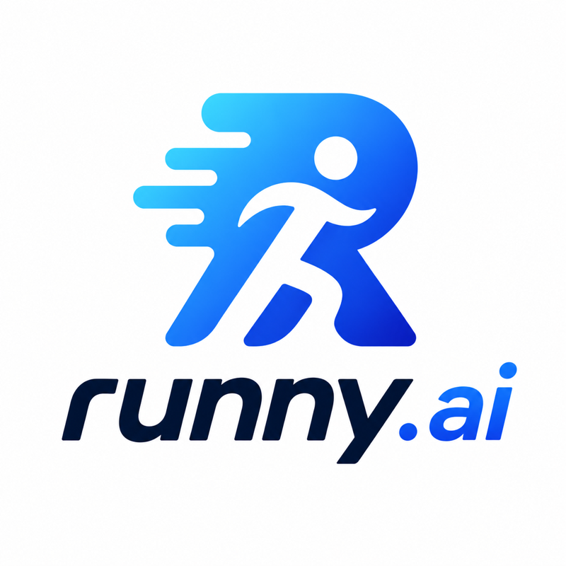

<p align="center">
  
</p>

<h1 align="center">AI-powered running coach for Garmin</h1>

<p align="center">
  <a href="https://www.python.org/downloads/"></a>
  <a href="https://streamlit.io/"></a>
  <a href="LICENSE"></a>
</p>

**Runny.AI** connects to your Garmin account, analyzes your training history, and lets you chat with an AI coach about your data to generate personalized running workouts — then uploads them directly to your Garmin watch.

Built with [Streamlit](https://streamlit.io/), [Claude](https://www.anthropic.com/) (via [OpenRouter](https://openrouter.ai/)), and [garminconnect](https://github.com/cyberjunky/python-garminconnect).

## Demo

Load your Garmin data, chat with your AI coach, get a personalized workout, and upload it to your Garmin watch — all in one flow:


## How It Works

1. **Fetch** — Connect your Garmin account and load your recent activities, VO2max, heart rate zones, training load, and race predictions
2. **Analyze** — Runny.AI reviews your training history and builds a runner profile with insights on volume, intensity distribution, pace trends, and heart rate efficiency
3. **Chat** — Ask your AI coach for advice or a workout ("tempo run", "long easy run", "VO2max intervals") — it knows your fitness level and tailors every response to your data
4. **Generate** — Runny.AI creates a structured workout with phases, target paces, and HR zones that you can review before uploading
5. **Upload** — Send the workout directly to Garmin Connect and schedule it on your calendar — ready on your watch

## Features

- **Training Analysis** — Insights on volume, intensity distribution, pace trends, and heart rate efficiency based on your recent runs
- **Personalized Workouts** — Structured interval and steady-state workouts tailored to your fitness level, training history, and race goals
- **Garmin Integration** — Upload workouts directly to Garmin Connect and schedule them on your calendar
- **Runner Profile** — VO2max, HR zones, training load, race predictions, and more pulled from your Garmin data
- **Race Goal Planning** — Set a target race (5K to marathon) with a goal time, and Runny.AI adapts recommendations accordingly

## Setup

### Prerequisites

- Python 3.13+
- [uv](https://docs.astral.sh/uv/) package manager
- A Garmin Connect account
- An [OpenRouter](https://openrouter.ai/) API key

### Install uv

[uv](https://docs.astral.sh/uv/) is a fast Python package manager. Install it with:

```bash
# macOS / Linux
curl -LsSf https://astral.sh/uv/install.sh | sh

# Windows
powershell -ExecutionPolicy ByPass -c "irm https://astral.sh/uv/install.ps1 | iex"
```

### Get an OpenRouter API key

1. Create an account at [openrouter.ai](https://openrouter.ai/)
2. Go to [Keys](https://openrouter.ai/keys) and click **Create Key**
3. Copy the key — you'll need it in the configuration step below

### Installation

```bash
git clone https://github.com/MauroLuzzatto/ai-runny.git
cd ai-runny
uv sync
```

### Configuration

Create a `.streamlit/secrets.toml` file:

```toml
OPENROUTER_KEY = "your-openrouter-api-key"
GARMIN_EMAIL = "your-garmin-email"
GARMIN_PASSWORD = "your-garmin-password"
```

Or enter credentials directly in the app sidebar.

### Run

```bash
uv run streamlit run app.py
```

## How It Works Under the Hood

1. **Authenticate** — Log in to Garmin Connect with your credentials
2. **Fetch data** — Pull your recent activities, VO2max, heart rate zones, training load, and race predictions from the Garmin API
3. **Build context** — Activities are validated into structured Pydantic models and summarized into a training profile that is injected into the system prompt
4. **Chat with the AI coach** — Claude (via OpenRouter) receives your training context and responds to your questions. When you ask for a workout, the LLM makes a tool call with structured parameters (intervals, paces, HR targets)
5. **Build the workout** — Tool call parameters are used to construct a Garmin-compatible workout object with the correct step types, end conditions, and targets
6. **Review and upload** — The proposed workout is displayed in the app for review. On confirmation, it is uploaded to Garmin Connect and optionally scheduled on a specific date

## Privacy

No GPS data, location, or personal identifiers leave your machine. Only aggregated training metrics (distance, pace, heart rate, training effect) are included in prompts. See [Privacy Policy](?page=privacy) in the app for details.

## License

MIT
